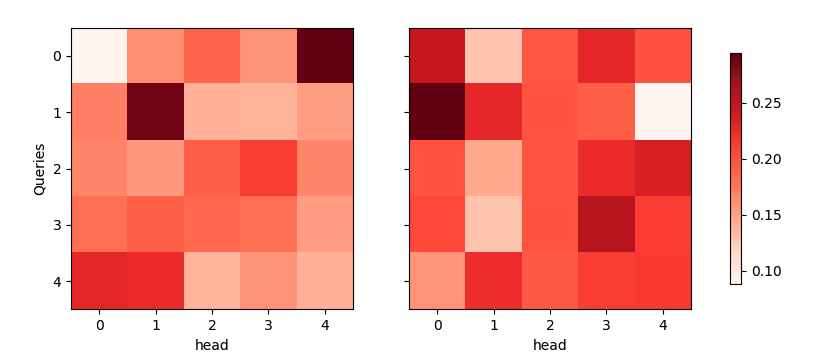

#  Transformer from Scratch

---

##  Project Overview
This project is a **from-scratch reimplementation** of the core Transformer architecture, designed for those who want to deeply understand how modern large language models (LLMs) work under the hood.  
It focuses on clarity, modularity, and educational value, while maintaining functional completeness.

 **Core Features**
- Token & Positional Embedding
- Scaled Dot-Product Attention + Multi-Head Attention
- Feed Forward Network (FFN)
- Residual Connection + Layer Normalization
- Stackable Encoder Blocks
- Stackable Decoder Blocks
- Minimal training example on MTFraEng
- Attention heatmap visualization

---

## Architecture Overview
Input Text → Token Embedding → Positional Encoding
→ Multi-Head Attention → Add & Norm
→ Feed Forward Network → Add & Norm
→ Output Representation

---

## Getting Started

### Environment Setup
```bash
git clone https://github.com/EllenLiu2019/transformer-lab.git
cd transformer-lab
pip install -r requirements.txt
```

## Attention Visualization
```python
# Example: Visualize Attention Weights
from plot_attention_heatmap import plot_attention
plot_attention()

```


---
## Tech Stack
* Language: Python 3.10+
* Core Libraries: PyTorch, NumPy, Matplotlib, d2l
* Optional Tools: Jupyter, tqdm, Hugging Face Datasets (for small demos)
---
## Author Notes

This project is part of my AI + Financial Systems Learning Path, focusing on bridging theoretical AI foundations with practical applications in intelligent risk control, claim processing, and enterprise AI architecture.
If you find this helpful or want to discuss system design, connect with me on [LinkedIn](https://www.linkedin.com/in/xiaojing-ellen-liu/) or contact me via email at <liuxiaojing11@126.com> .

---
## References
* [Dive Into Deep Learning](https://zh-v2.d2l.ai/)
* [Attention Is All You Need (Vaswani et al., 2017)](https://arxiv.org/abs/1706.03762)
* [The Illustrated Transformer – Jay Alammar](https://jalammar.github.io/illustrated-transformer/)
* [PyTorch Official Tutorials](https://docs.pytorch.org/docs/stable/index.html)

---
## Acknowledgments

The d2l.ai open source community and textbook implementation


